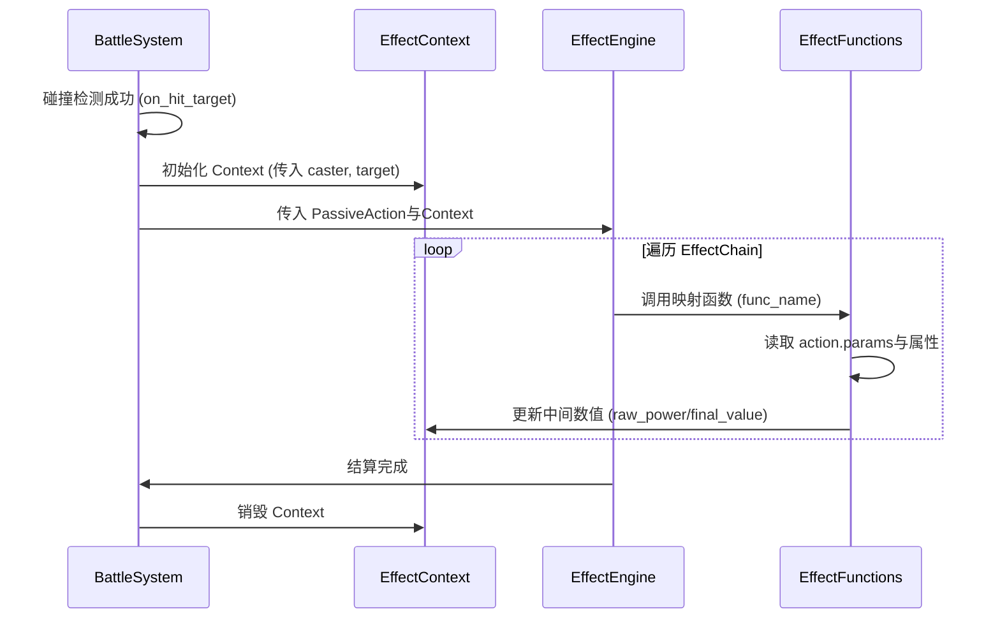
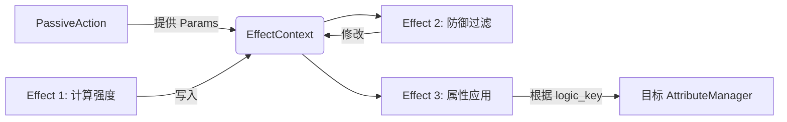
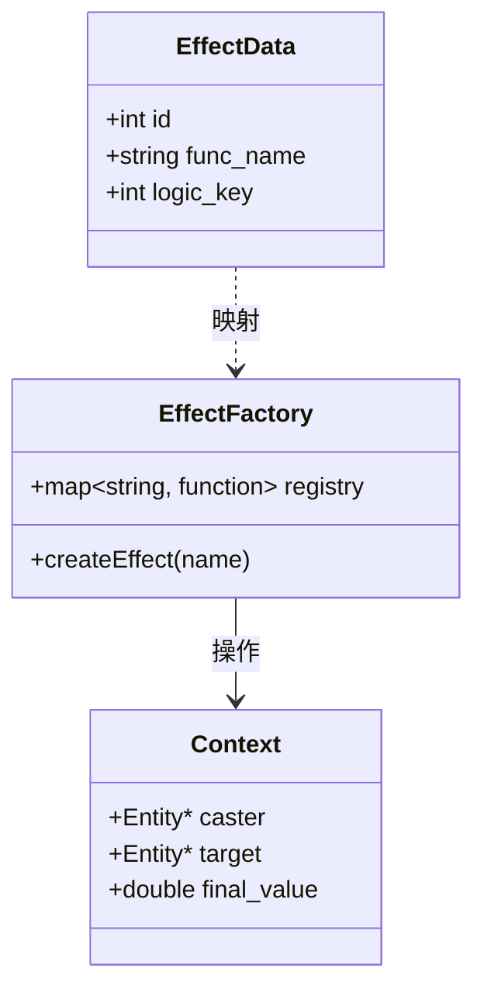

# Game Design Spec(游戏设计规范)

## 1.Base Definition(基本定义)

### 1.1.Base Structs(基本结构)

#### 1.1.1.Core Attributes(核心属性)

##### 1.1.1.1.Attributes

|      属性      | 类型  |   作用   | 备注  |
| :------------: | :---: | :------: | :---: |
|   `strength`   | `int` |   力量   |   -   |
|   `physique`   | `int` |   体质   |   -   |
|  `dexterity`   | `int` |   灵巧   |   -   |
|   `esthesia`   | `int` |   感知   |   -   |
| `bewitchment`  | `int` |   魔力   |   -   |
|  `willpower`   | `int` |   意志   |   -   |
| `life_growth`  | `int` | 生命成长 |   -   |
| `magic_growth` | `int` | 法力成长 |   -   |
|    `speed`     | `int` |   速度   |   -   |
|     `luck`     | `int` |   幸运   |   -   |

##### 1.1.1.2.Mod

|  属性  |   类型   |    作用    | 备注  |
| :----: | :------: | :--------: | :---: |
| `pct`  | `double` | 百分比加成 |   -   |
| `flat` |  `int`   | 固定值加成 |   -   |

#### 1.1.2.Property Containers(属性容器)

##### 1.1.2.1.DerivedStats

|              属性              |   类型   |       作用       |  备注   |
| :----------------------------: | :------: | :--------------: | :-----: |
|            `max_hp`            |  `int`   |    最大生命值    |    -    |
|            `max_mp`            |  `int`   |    最大法力值    |    -    |
|            `max_sp`            |  `int`   |    最大精力值    |    -    |
|  `base_physical_attack_power`  |  `int`   |  基础物理攻击力  |    -    |
|  `base_magical_attack_power`   |  `int`   |  基础魔法攻击力  |    -    |
|          `block_rate`          | `double` |      格挡率      | 上限50% |
|        `evasion_value`         |  `int`   |      闪避值      |    -    |
|      `physical_hit_value`      |  `int`   |    物理命中值    |    -    |
|      `magical_hit_value`       |  `int`   |    法术命中值    |    -    |
|      `physical_crit_rate`      | `double` |    物理暴击率    | 上限95% |
|      `magical_crit_rate`       | `double` |    魔法暴击率    | 上限95% |
|       `physical_defense`       |  `int`   |    物理防御力    |    -    |
|       `magical_defense`        |  `int`   |    魔法防御力    |    -    |
|  `physical_damage_reduction`   | `double` |     物理减伤     | 上限50% |
|   `magical_damage_reduction`   | `double` |     魔法减伤     | 上限50% |
|    `true_damage_reduction`     | `double` |     真实减伤     | 上限50% |
| `ignore_physical_defense_rate` | `double` | 无视物理防御几率 | 上限60% |
| `ignore_magical_defense_rate`  | `double` | 无视魔法防御几率 | 上限60% |
|     `physical_crit_damage`     | `double` |     物理爆伤     |    -    |
|     `magical_crit_damage`      | `double` |     魔法爆伤     |    -    |
|   `physical_damage_increase`   | `double` |     物理增伤     |    -    |
|   `magical_damage_increase`    | `double` |     魔法增伤     |    -    |

##### 1.1.2.2.BonusStats

|              属性              |       类型        |         作用         | 备注  |
| :----------------------------: | :---------------: | :------------------: | :---: |
|           `strength`           | [`Mod`](#1112mod) |       力量加成       |   -   |
|           `physique`           | [`Mod`](#1112mod) |       体质加成       |   -   |
|          `dexterity`           | [`Mod`](#1112mod) |       灵巧加成       |   -   |
|           `esthesia`           | [`Mod`](#1112mod) |       感知加成       |   -   |
|         `bewitchment`          | [`Mod`](#1112mod) |       魔力加成       |   -   |
|          `willpower`           | [`Mod`](#1112mod) |       意志加成       |   -   |
|         `life_growth`          | [`Mod`](#1112mod) |     生命成长加成     |   -   |
|         `magic_growth`         | [`Mod`](#1112mod) |     法力成长加成     |   -   |
|            `speed`             | [`Mod`](#1112mod) |       速度加成       |   -   |
|             `luck`             | [`Mod`](#1112mod) |       幸运加成       |   -   |
|            `max_hp`            | [`Mod`](#1112mod) |    最大生命值加成    |   -   |
|            `max_mp`            | [`Mod`](#1112mod) |    最大法力值加成    |   -   |
|  `base_physical_attack_power`  | [`Mod`](#1112mod) |  基础物理攻击力加成  |   -   |
|  `base_magical_attack_power`   | [`Mod`](#1112mod) |  基础魔法攻击力加成  |   -   |
|        `evasion_value`         | [`Mod`](#1112mod) |      闪避值加成      |   -   |
|      `physical_hit_value`      | [`Mod`](#1112mod) |    物理命中值加成    |   -   |
|      `magical_hit_value`       | [`Mod`](#1112mod) |    法术命中值加成    |   -   |
|       `physical_defense`       | [`Mod`](#1112mod) |    物理防御力加成    |   -   |
|       `Magical_defense`        | [`Mod`](#1112mod) |    魔法防御力加成    |   -   |
|     `physical_crit_damage`     |     `double`      |     物理爆伤加成     |   -   |
|     `magical_crit_damage`      |     `double`      |     魔法爆伤加成     |   -   |
|      `physical_crit_rate`      |     `double`      |    物理暴击率加成    |   -   |
|      `magical_crit_rate`       |     `double`      |    魔法暴击率加成    |   -   |
|          `block_rate`          |     `double`      |      格挡率加成      |   -   |
|  `physical_damage_reduction`   |     `double`      |     物理减伤加成     |   -   |
|   `magical_damage_reduction`   |     `double`      |     魔法减伤加成     |   -   |
|    `true_damage_reduction`     |     `double`      |     真实减伤加成     |   -   |
| `ignore_physical_defense_rate` |     `double`      | 无视物理防御几率加成 |   -   |
| `ignore_magical_defense_rate`  |     `double`      | 无视魔法防御几率加成 |   -   |
|   `physical_damage_increase`   |     `double`      |     物理增伤加成     |   -   |
|   `magical_damage_increase`    |     `double`      |     魔法增伤加成     |   -   |

### 1.2.Attribute Map(属性映射表)

约定了在生物实例内，定义的一级属性、二级属性、实时状态数组下标与属性之间的映射关系。

此表定义了 `Attr::ID` 枚举值及其对应的数组索引，用于 `AttributeManager` 的统一结算。

[*索引范围一览*](#4221attribute-id)

| 对应枚举名 (`Attr::ID::...`) |   类型   | 描述 (Category)              | 数组索引 |
| :--------------------------- | :------: | :--------------------------- | :------: |
| **BaseStrength**             |  `int`   | 基础一级属性                 |   $1$    |
| **BasePhysique**             |  `int`   | 基础一级属性                 |   $2$    |
| **BaseDexterity**            |  `int`   | 基础一级属性                 |   $3$    |
| **BaseEsthesia**             |  `int`   | 基础一级属性                 |   $4$    |
| **BaseBewitchment**          |  `int`   | 基础一级属性                 |   $5$    |
| **BaseWillpower**            |  `int`   | 基础一级属性                 |   $6$    |
| **BaseLifeGrowth**           |  `int`   | 基础一级属性                 |   $7$    |
| **BaseMagicGrowth**          |  `int`   | 基础一级属性                 |   $8$    |
| **BaseSpeed**                |  `int`   | 基础一级属性                 |   $9$    |
| **BaseLuck**                 |  `int`   | 基础一级属性                 |   $10$   |
| **DerivedPhysAtk**           |  `int`   | 二级属性基准 (公式产出)      |  $101$   |
| **DerivedMagAtk**            |  `int`   | 二级属性基准 (公式产出)      |  $102$   |
| **DerivedBlockRate**         | `double` | 二级属性基准 (公式产出)      |  $103$   |
| **DerivedEvasion**           |  `int`   | 二级属性基准 (公式产出)      |  $104$   |
| **DerivedPhysHit**           |  `int`   | 二级属性基准 (公式产出)      |  $105$   |
| **DerivedMagHit**            |  `int`   | 二级属性基准 (公式产出)      |  $106$   |
| **DerivedPhysCritRate**      | `double` | 二级属性基准 (公式产出)      |  $107$   |
| **DerivedMagCritRate**       | `double` | 二级属性基准 (公式产出)      |  $108$   |
| **DerivedPhysDef**           |  `int`   | 二级属性基准 (公式产出)      |  $109$   |
| **DerivedMagDef**            |  `int`   | 二级属性基准 (公式产出)      |  $110$   |
| **DerivedPhysDamageRed**     | `double` | 二级属性基准 (公式产出)      |  $111$   |
| **DerivedMagDamageRed**      | `double` | 二级属性基准 (公式产出)      |  $112$   |
| **DerivedTrueDamageRed**     | `double` | 二级属性基准 (公式产出)      |  $113$   |
| **DerivedIgnorePhysDef**     | `double` | 二级属性基准 (公式产出)      |  $114$   |
| **DerivedIgnoreMagDef**      | `double` | 二级属性基准 (公式产出)      |  $115$   |
| **DerivedPhysCritDmg**       | `double` | 二级属性基准 (公式产出)      |  $117$   |
| **DerivedMagCritDmg**        | `double` | 二级属性基准 (公式产出)      |  $118$   |
| **DerivedPhysDamageInc**     | `double` | 二级属性基准 (公式产出)      |  $119$   |
| **DerivedMagDamageInc**      | `double` | 二级属性基准 (公式产出)      |  $120$   |
| **ModStrength**              |  `Mod`   | 属性加成 (支持固定值/百分比) |  $301$   |
| **ModPhysique**              |  `Mod`   | 属性加成 (支持固定值/百分比) |  $302$   |
| **ModDexterity**             |  `Mod`   | 属性加成 (支持固定值/百分比) |  $303$   |
| **ModEsthesia**              |  `Mod`   | 属性加成 (支持固定值/百分比) |  $304$   |
| **ModBewitchment**           |  `Mod`   | 属性加成 (支持固定值/百分比) |  $305$   |
| **ModWillpower**             |  `Mod`   | 属性加成 (支持固定值/百分比) |  $306$   |
| **ModLifeGrowth**            |  `Mod`   | 属性加成 (支持固定值/百分比) |  $307$   |
| **ModMagicGrowth**           |  `Mod`   | 属性加成 (支持固定值/百分比) |  $308$   |
| **ModSpeed**                 |  `Mod`   | 属性加成 (支持固定值/百分比) |  $309$   |
| **ModLuck**                  |  `Mod`   | 属性加成 (支持固定值/百分比) |  $310$   |
| **ModMaxHP**                 |  `Mod`   | 属性加成 (支持固定值/百分比) |  $311$   |
| **ModMaxMP**                 |  `Mod`   | 属性加成 (支持固定值/百分比) |  $312$   |
| **ModPhysAtk**               |  `Mod`   | 属性加成 (支持固定值/百分比) |  $313$   |
| **ModMagAtk**                |  `Mod`   | 属性加成 (支持固定值/百分比) |  $314$   |
| **ModEvasion**               |  `Mod`   | 属性加成 (支持固定值/百分比) |  $315$   |
| **ModPhysHit**               |  `Mod`   | 属性加成 (支持固定值/百分比) |  $316$   |
| **ModMagHit**                |  `Mod`   | 属性加成 (支持固定值/百分比) |  $317$   |
| **ModPhysDef**               |  `Mod`   | 属性加成 (支持固定值/百分比) |  $318$   |
| **ModMagDef**                |  `Mod`   | 属性加成 (支持固定值/百分比) |  $319$   |
| **ModPhysCritDmg**           | `double` | 率加成 (直接加法结算)        |  $320$   |
| **ModMagCritDmg**            | `double` | 率加成 (直接加法结算)        |  $321$   |
| **ModPhysCritRate**          | `double` | 率加成 (直接加法结算)        |  $322$   |
| **ModMagCritRate**           | `double` | 率加成 (直接加法结算)        |  $323$   |
| **ModBlockRate**             | `double` | 率加成 (直接加法结算)        |  $324$   |
| **ModPhysDamageRed**         | `double` | 率加成 (直接加法结算)        |  $325$   |
| **ModMagDamageRed**          | `double` | 率加成 (直接加法结算)        |  $326$   |
| **ModTrueDamageRed**         | `double` | 率加成 (直接加法结算)        |  $327$   |
| **ModIgnorePhysDef**         | `double` | 率加成 (直接加法结算)        |  $328$   |
| **ModIgnoreMagDef**          | `double` | 率加成 (直接加法结算)        |  $329$   |
| **ModPhysDamageInc**         | `double` | 率加成 (直接加法结算)        |  $330$   |
| **ModMagDamageInc**          | `double` | 率加成 (直接加法结算)        |  $331$   |
| **FinalStrength**            |  `int`   | 最终属性 (用于战斗/逻辑)     |  $501$   |
| **FinalPhysique**            |  `int`   | 最终属性 (用于战斗/逻辑)     |  $502$   |
| **FinalDexterity**           |  `int`   | 最终属性 (用于战斗/逻辑)     |  $503$   |
| **FinalEsthesia**            |  `int`   | 最终属性 (用于战斗/逻辑)     |  $504$   |
| **FinalBewitchment**         |  `int`   | 最终属性 (用于战斗/逻辑)     |  $505$   |
| **FinalWillpower**           |  `int`   | 最终属性 (用于战斗/逻辑)     |  $506$   |
| **FinalLifeGrowth**          |  `int`   | 最终属性 (用于战斗/逻辑)     |  $507$   |
| **FinalMagicGrowth**         |  `int`   | 最终属性 (用于战斗/逻辑)     |  $508$   |
| **FinalSpeed**               |  `int`   | 最终属性 (用于战斗/逻辑)     |  $509$   |
| **FinalLuck**                |  `int`   | 最终属性 (用于战斗/逻辑)     |  $510$   |
| **FinalPhysAtk**             |  `int`   | 最终属性 (用于战斗/逻辑)     |  $511$   |
| **FinalMagAtk**              |  `int`   | 最终属性 (用于战斗/逻辑)     |  $512$   |
| **FinalBlockRate**           | `double` | 最终属性 (用于战斗/逻辑)     |  $513$   |
| **FinalEvasion**             |  `int`   | 最终属性 (用于战斗/逻辑)     |  $514$   |
| **FinalPhysHit**             |  `int`   | 最终属性 (用于战斗/逻辑)     |  $515$   |
| **FinalMagHit**              |  `int`   | 最终属性 (用于战斗/逻辑)     |  $516$   |
| **FinalPhysCritRate**        | `double` | 最终属性 (用于战斗/逻辑)     |  $517$   |
| **FinalMagCritRate**         | `double` | 最终属性 (用于战斗/逻辑)     |  $518$   |
| **FinalPhysDef**             |  `int`   | 最终属性 (用于战斗/逻辑)     |  $519$   |
| **FinalMagDef**              |  `int`   | 最终属性 (用于战斗/逻辑)     |  $520$   |
| **FinalPhysDamageRed**       | `double` | 最终属性 (用于战斗/逻辑)     |  $521$   |
| **FinalMagDamageRed**        | `double` | 最终属性 (用于战斗/逻辑)     |  $522$   |
| **FinalTrueDamageRed**       | `double` | 最终属性 (用于战斗/逻辑)     |  $523$   |
| **FinalIgnorePhysDef**       | `double` | 最终属性 (用于战斗/逻辑)     |  $524$   |
| **FinalIgnoreMagDef**        | `double` | 最终属性 (用于战斗/逻辑)     |  $525$   |
| **FinalPhysCritDmg**         | `double` | 最终属性 (用于战斗/逻辑)     |  $526$   |
| **FinalMagCritDmg**          | `double` | 最终属性 (用于战斗/逻辑)     |  $527$   |
| **FinalPhysDamageInc**       | `double` | 最终属性 (用于战斗/逻辑)     |  $528$   |
| **FinalMagDamageInc**        | `double` | 最终属性 (用于战斗/逻辑)     |  $529$   |
| **CurMaxHP**                 |  `int`   | 实时状态 (当前上限)          |  $701$   |
| **CurMaxMP**                 |  `int`   | 实时状态 (当前上限)          |  $702$   |
| **CurMaxSP**                 |  `int`   | 实时状态 (当前上限)          |  $703$   |
| **CurLevel**                 |  `int`   | 实时状态                     |  $704$   |
| **CurExp**                   |  `int`   | 实时状态                     |  $705$   |

### 1.3.Hard Constants(静态定义)

#### 1.3.1.Base Type

##### 1.3.1.1.Damage Type

|   类型名   |   含义   | 备注  |   JSON名   |
| :--------: | :------: | :---: | :--------: |
| `Physical` | 物理伤害 |   -   | "physical" |
| `Magical`  | 魔法伤害 |   -   | "magical"  |
|   `True`   | 真实伤害 |   -   |   "true"   |

#### 1.3.2.Combat Type

##### 1.3.2.1.HitResult

|   类型名   | 含义  | 备注  | JSON名 |
| :--------: | :---: | :---: | :----: |
|   `Miss`   | 闪避  |   -   |   -    |
|   `Hit`    | 命中  |   -   |   -    |
| `Critical` | 暴击  |   -   |   -    |
|  `Block`   | 格挡  |   -   |   -    |

#### 1.3.3.Item Type

##### 1.3.3.1.RarityType

|   类型名    |    含义    | 备注  |    JSON     |
| :---------: | :--------: | :---: | :---------: |
|   `Junk`    | 垃圾，灰色 |   -   |   "junk"    |
|  `Common`   | 基础，白色 |   -   |  "common"   |
| `Uncommon`  | 精良，绿色 |   -   | "uncommon"  |
|   `Rare`    | 稀有，蓝色 |   -   |   "rare"    |
|   `Epic`    | 史诗，紫色 |   -   |   "epic"    |
| `Legendary` | 传说，橙色 |   -   | "legendary" |
| `Artifact`  | 神话，红色 |   -   | "artifact"  |

##### 1.3.3.2.ItemType

|    类型名    |    含义    | 备注  |     JSON     |
| :----------: | :--------: | :---: | :----------: |
|   `Weapon`   |    武器    |   -   |   "weapon"   |
|   `Armor`    |    防具    |   -   |   "armor"    |
| `Accessory`  |    饰品    |   -   | "accessory"  |
| `Comsumable` | 可消耗物品 |   -   | "comsumable" |
|  `Material`  |    材料    |   -   |  "material"  |
|   `Quest`    |  任务物品  |   -   |   "quest"    |

#### 1.3.4.Error Type

##### 1.3.4.1.ErrorCode

|         类型名         |      含义      |   备注    | JSON  |
| :--------------------: | :------------: | :-------: | :---: |
|       `Success`        |     无异常     | 默认值为0 |   -   |
|     `FileNotFound`     |   未找到文件   |     -     |   -   |
| `FilePermissionDenied` | 文件访问被拒绝 |     -     |   -   |
|    `JsonParseError`    |  JSON解析错误  |     -     |   -   |
| `MissingRequiredField` |  缺失需求部分  |     -     |   -   |
|   `DataTypeMismatch`   | 数据类型不匹配 |     -     |   -   |
|     `DuplicateId`      |    重复的ID    |     -     |   -   |
|   `ResourceNotFound`   |   未找到源头   |     -     |   -   |
|   `InvalidOperation`   |    非法操作    |     -     |   -   |

## 2.Data Struct(数据结构)

### 2.1.Race Data

#### 2.1.1.RaceData Definition

|    属性名     |              类型               |            作用            |                     备注                      |
| :-----------: | :-----------------------------: | :------------------------: | :-------------------------------------------: |
|     `id`      |              `int`              |            标识            | [id范围](#42data-id-specifications数据id规范) |
|    `name`     |            `string`             |            名称            |                       -                       |
| `description` |            `string`             |          描述文本          |                       -                       |
|  `base_attr`  | [`Attributes`](#1111attributes) | 为生物提供初始种族奖励属性 |                       -                       |
| `race_skills` |             `list`              |   为生物提供初始种族技能   |                       -                       |

#### 2.1.2.RaceData Example

```json
{
    "id": 110002,
    "name": "番茄族",
    "description": "完美的代名词！神圣的种族！上帝的谕旨！",
    "base_attr": {
      "strength": 6,
      "physique": 7,
      "dexterity": 4,
      "esthesia": 5,
      "bewitchment": 4,
      "willpower": 10,
      "life_growth": 70,
      "magic_growth": 40,
      "speed": 4,
      "luck": 13
    },
    "race_skills": [200001, 200002]
}
```

### 2.2.Job Data

#### 2.2.1.JobData

|    属性名     |              类型               |            作用            |                     备注                      |
| :-----------: | :-----------------------------: | :------------------------: | :-------------------------------------------: |
|     `id`      |              `int`              |            标识            | [id范围](#42data-id-specifications数据id规范) |
|    `name`     |            `string`             |            名称            |                       -                       |
| `description` |            `string`             |          描述文字          |                       -                       |
|  `base_attr`  | [`Attributes`](#1111attributes) | 为生物提供初始职业奖励属性 |                       -                       |
| `job_skills`  |             `list`              |   为生物提供初始职业技能   |                       -                       |

#### 2.2.2.JobData Example

```json
{
    "id": 113001,
    "name": "战士",
    "description": "他们不诵咒文，不信神谕。\n唯一的信仰，是手中钢铁的重量，与胸膛里未曾熄灭的火。\n战士是行走于大地之上最古老的传说——当魔法在指尖枯萎，当诡计在暗处凋零，唯有握紧剑柄的人，仍站在战场的中央。\n他的伤疤是地图，记着走过的每一条绝路；\n他的战吼是雷鸣，惊醒懦弱者的黄昏。\n若你选择成为战士，便是选择将血肉锻成矛与盾，在世界的裂痕之上，独自站立。",
    "base_attr": {
      "strength": 8,
      "physique": 6,
      "dexterity": 5,
      "esthesia": 5,
      "bewitchment": 2,
      "willpower": 6,
      "life_growth": 120,
      "magic_growth": 50,
      "speed": 5,
      "luck": 7
    },
    "job_skills": [200001, 200002]
}
```

### 2.3.Skill Data

#### 2.3.1.SkillData

|      属性名      |                     类型                     |            作用            |          备注           |
| :--------------: | :------------------------------------------: | :------------------------: | :---------------------: |
|       `id`       |                    `int`                     |            标识            | [id范围](#4222skill-id) |
|      `name`      |                   `string`                   |            名称            |            -            |
|  `description`   |                   `string`                   |          描述文字          |            -            |
| `display_effect` |                   `string`                   | 在数据和技能效果方面的描述 |            -            |
|   `behaviors`    | [`BehaviorComponent`](#512behaviorcomponent) |   描述技能携带的行为列表   |            -            |

### 2.4.Effect Data

|      属性       |   类型   |          作用          |                     备注                      |
| :-------------: | :------: | :--------------------: | :-------------------------------------------: |
|      `id`       |  `int`   |          标识          | [id范围](#42data-id-specifications数据id规范) |
|     `name`      | `string` |          名称          |                       -                       |
|  `description`  | `string` |        描述文字        |                       -                       |
|   `func_name`   | `string` | 描述effect对应的函数名 |                       -                       |
| `logic_address` |  `int`   |      逻辑定位参数      |                       -                       |

### 2.5.Buff Data

|     属性      |                     类型                     |          作用          |                     备注                      |
| :-----------: | :------------------------------------------: | :--------------------: | :-------------------------------------------: |
|     `id`      |                    `int`                     |          标识          | [id范围](#42data-id-specifications数据id规范) |
|    `name`     |                   `string`                   |          名称          |                       -                       |
| `description` |                   `string`                   |        描述文字        |                       -                       |
|  `behaviors`  | [`BehaviorComponent`](#512behaviorcomponent) | 描述技能携带的行为列表 |                       -                       |

### 2.6.Item Data

#### 2.6.1.ItemData

|        属性         |                     类型                     |           作用           |                                                   备注                                                   |
| :-----------------: | :------------------------------------------: | :----------------------: | :------------------------------------------------------------------------------------------------------: |
|       `type`        |         [`ItemType`](#1332itemtype)          |      标记物品的类型      |                                                    -                                                     |
|      `weight`       |                   `double`                   |      表示物品的重量      |                                                    -                                                     |
|     `stackable`     |                    `bool`                    |        是否可堆叠        |                                                    -                                                     |
|  `default_rarity`   |            [`Rarity`](#263rarity)            |    表示物品的默认品质    |                                                    -                                                     |
|    `usage_count`    |                    `int`                     |        可使用次数        |                                            该属性为非必须属性                                            |
|  `base_attr_pool`   |                    `list`                    |   装备类型的基础属性池   |  实例化时该属性池内每条属性都会被抽出，`list`元素类型为[`AttrRange`](#262attrrange),该属性为非必须属性   |
| `random_affix_pool` |                    `list`                    |   装备类型的随机属性池   | 实例化时在该属性池内随机抽取 $n$ 条属性,`list`元素类型为[`AttrRange`](#262attrrange)，该属性为非必须属性 |
|     `behaviors`     | [`BehaviorComponent`](#512behaviorcomponent) | 表示物品可能触发的行为池 |                                            该属性为非必须属性                                            |

#### 2.6.2.AttrRange

|     属性     |                   类型                   |               作用               | 备注  |
| :----------: | :--------------------------------------: | :------------------------------: | :---: |
|     `id`     | [`Attr::ID`](#12attribute-map属性映射表) |         表示对应属性的ID         |   -   |
|  `min_val`   |                 `double`                 |     表示随机生成属性的最小值     |   -   |
|  `max_val`   |                 `double`                 |     表示随机生成属性的最大值     |   -   |
| `is_percent` |                  `bool`                  | 标记当前属性词条是否为百分比加成 |   -   |

#### 2.6.3.Rarity

|      属性       |              类型               |   作用   |       备注       |
| :-------------: | :-----------------------------: | :------: | :--------------: |
|  `rarity_type`  | [`RarityType`](#1331raritytype) | 品质类型 |        -         |
|     `level`     |              `int`              | 装备等级 |        -         |
| `hidden_points` |              `int`              |  隐藏分  | 范围为 $0 - 100$ |

## 3.Core Game Design(核心游戏设计)

### 3.1.Effect Execution Pipline(效果执行流水线)

#### 3.1.1.Core Concept Definition(核心概念定义)

- **EffectContext(执行上下文)**：一个临时对象，用于在单个Action的多个Effect之间传递中间计算数值。
- **EffectFunction(逻辑函数)**：由[`func_name`](#24effect-data)映射的原子逻辑单元，负责修改**Context**或**Entity**状态。
- **LogicAddress(逻辑定位键)**：用于指定函数操作的具体目标（如属性索引或Buff ID）。

#### 3.1.2.Illustration(流程图示)

##### 3.1.2.1.Sequence Diagram(逻辑时序图)



##### 3.1.2.2.Flowchart(线性流水线图)



##### 3.1.2.3.Class Diagram(数据结构映射图)



#### 3.1.3.Detailed Execution Steps(详细执行步骤)

|      阶段      |     步骤      |    执行主体     |                                              详细说明                                              |
| :------------: | :-----------: | :-------------: | :------------------------------------------------------------------------------------------------: |
|   **1.触发**   | 碰撞/事件监听 | `BattleSystem`  |                          监测到技能碰撞或被动触发点（如 `on_hit_target`）                          |
|  **2.初始化**  |  构建Context  | `EffectEngine`  |                     创建 `EffectContext` 实例，注入 `caster` 和 `target` 指针                      |
| **3.序列检索** | 获取Effect键  | `ActionManager` |                  根据 `PassiveAction` 的 `action_id` 检索对应的 `EffectData` 列表                  |
| **4.循环执行** |   逻辑迭代    | `EffectFactory` |                         按 JSON 定义的顺序，依次调用每个 Effect 映射的函数                         |
| **5.数值计算** | 强度/减伤过滤 |  `EffectFunc`   | 函数从 [`PassiveAction.params`](#511passiveaction) 读倍率，从 `Entity` 读属性，更新 Context 的数值 |
| **6.状态应用** |   最终结算    |  `EffectFunc`   |  最后的 `Effect` 根据 [`logic_address`](#24effect-data) 将 Context 里的最终数值写入目标的属性数组  |
|   **7.销毁**   |   回收资源    | `EffectEngine`  |                        结算完成，清空 Context 缓存，触发死亡判定等后续检查                         |

#### 3.1.4.Typical Implementation Case(典型执行案例)

**配置数据：**

- `Action.params: { "coefficient": 1.5, "vampire_rate": 0.2 }`
- `EffectChain: [30001(物攻计算), 30002(防御减免), 30004(吸血转化), 30003(目标扣血), 30005(自身回血)]`

**执行流：**

1.**Effect 30001**: 读 `caster` 的属性 $511$（物攻），乘以 $1.5$，写入 `ctx.raw_power`

2.**Effect 30002**: 读 `target` 的属性 $512$（防御），从 `ctx.raw_power` 中减去，写入 `ctx.final_value`

3.**Effect 30004**: 读 `ctx.final_value`，乘以 $0.2$，写入 `ctx.heal_value`

4.**Effect 30003**: 读 `logic_key=701`（血量），令 `target` 属性 $701$ 减少 `ctx.final_value`

5.**Effect 30005**: 读 `logic_key=701`，令 `caster` 属性 $701$ 增加 `ctx.heal_value`

### 3.2.Base Formula & Parameter Setting(基本公式和参数设定)

#### 3.2.1.Primary To Derived(一级属性转二级属性)

##### 3.2.1.1.BaseMaxHP(基础最大生命值)

$$
\text{BaseMaxHP = Strength} \times \text{HPPerStrength} + \text{Physique} \times \text{HPPerPhysique} + \text{Willpower} \times \text{HPPerWillpower}
$$

|          参数           |  值   |
| :---------------------: | :---: |
| $\text{HPPerStrength}$  |  $8$  |
| $\text{HPPerPhysique}$  | $15$  |
| $\text{HPPerWillpower}$ |  $3$  |

##### 3.2.1.2.BaseMaxMP(基础最大法力值)

$$
\text{BaseMaxMP} = \text{Esthesia} \times \text{MPPerEsthesia} + \text{Bewitchment} \times \text{MPPerBewitchment} + \text{Willpower} \times \text{MPPerWillpower}
$$

|           参数            |  值   |
| :-----------------------: | :---: |
|  $\text{MPPerEsthesia}$   |  $3$  |
| $\text{MPPerBewitchment}$ | $12$  |
|  $\text{MPPerWillpower}$  |  $7$  |

##### 3.2.1.3.BaseMaxSP(基础最大精力值)

$$
\text{BaseMaxSP} = \text{Strength} \times \text{SPPerStrength} + \text{Physique} \times \text{SPPerPhysique} + \text{Willpower} \times \text{SPPerWillpower}
$$

|          参数           |  值   |
| :---------------------: | :---: |
| $\text{SPPerStrength}$  | $0.3$ |
| $\text{SPPerPhysique}$  | $0.5$ |
| $\text{SPPerWillpower}$ | $0.2$ |

##### 3.2.1.4.Evasion(闪避值)

$$
\text{Evasion} = \text{Dexterity} \times \text{EvasionPerDexterity} + \text{Esthesia} \times \text{EvasionPerEsthesia} + \text{Speed} \times \text{EvasionPerSpeed} + \text{Luck} \times \text{EvasionPerLuck}
$$

|             参数             |  值   |
| :--------------------------: | :---: |
| $\text{EvasionPerDexterity}$ |  $2$  |
| $\text{EvasionPerEsthesia}$  |  $1$  |
|   $\text{EvasionPerSpeed}$   |  $3$  |
|   $\text{EvasionPerLuck}$    |  $5$  |

##### 3.2.1.5.PhysicalHit(物理命中值)

$$
\text{PhysicalHit} = \text{Dexterity} \times \text{PhysicalHitPerDexterity} + \text{Esthesia} \times \text{PhysicalHitPerEsthesia} + \text{Speed} \times \text{PhysicalHitPerSpeed} + \text{Luck} \times \text{PhysicalHitPerLuck}
$$

|               参数               |  值   |
| :------------------------------: | :---: |
| $\text{PhysicalHitPerDexterity}$ |  $1$  |
| $\text{PhysicalHitPerEsthesia}$  |  $2$  |
|   $\text{PhysicalHitPerSpeed}$   |  $2$  |
|   $\text{PhysicalHitPerLuck}$    |  $3$  |

##### 3.2.1.6.MagicalHit(法术命中值)

$$
\text{MagicalHit} = \text{Esthesia} \times \text{MagicalHitPerEsthesia} + \text{Bewitchment} \times \text{MagicalHitPerBewitchment} + \text{Luck} \times \text{MagicalHitPerLuck}
$$

|               参数                |  值   |
| :-------------------------------: | :---: |
|  $\text{MagicalHitPerEsthesia}$   |  $1$  |
| $\text{MagicalHitPerBewitchment}$ |  $2$  |
|    $\text{MagicalHitPerLuck}$     |  $2$  |

##### 3.2.1.7.PhysicalDefense(物理防御力)

$$
\text{PhysicalDefense} = \text{Physique} \times \text{PhysicalDefensePerPhysique}
$$

|                参数                 |  值   |
| :---------------------------------: | :---: |
| $\text{PhysicalDefensePerPhysique}$ |  $3$  |

##### 3.2.1.8.MagicalDefense(魔法防御力)

$$
\text{MagicalDefense} = \text{Physique} \times \text{MagicalDefensePerPhysique} + \text{Bewitchment} \times \text{MagicalDefensePerBewitchment}
$$

|                 参数                  |  值   |
| :-----------------------------------: | :---: |
|  $\text{MagicalDefensePerPhysique}$   |  $1$  |
| $\text{MagicalDefensePerBewitchment}$ |  $2$  |

##### 3.2.1.9.IgnorePhysicalDefenseRate(忽视物理防御概率)

$$
\text{IgnorePhysicalDefenseRate} = \text{Strength} \times \text{IgnorePhysicalDefenseRatePerStrength} + \text{Esthesia} \times \text{IgnorePhysicalDefenseRatePerEsthesia} + \text{Luck} \times \text{IgnorePhysicalDefenseRatePerLuck}
$$

|                     参数                      |         值         |
| :-------------------------------------------: | :----------------: |
| $\text{IgnorePhysicalDefenseRatePerStrength}$ | $3 \times 10^{-5}$ |
| $\text{IgnorePhysicalDefenseRatePerEsthesia}$ | $7 \times 10^{-5}$ |
|   $\text{IgnorePhysicalDefenseRatePerLuck}$   | $1 \times 10^{-4}$ |

##### 3.2.1.10.IgnoreMagicalDefenseRate(忽视法术防御概率)

$$
\text{IgnoreMagicalDefenseRate} = \text{Bewitchment} \times \text{IgnoreMagicalDefenseRatePerBewitchment} + \text{Esthesia} \times \text{IgnoreMagicalDefenseRatePerEsthesia} + \text{Luck} \times \text{IgnoreMagicalDefenseRatePerLuck}
$$

|                      参数                       |         值         |
| :---------------------------------------------: | :----------------: |
| $\text{IgnoreMagicalDefenseRatePerBewitchment}$ | $4 \times 10^{-5}$ |
|  $\text{IgnoreMagicalDefenseRatePerEsthesia}$   | $5 \times 10^{-5}$ |
|    $\text{IgnoreMagicalDefenseRatePerLuck}$     | $1 \times 10^{-4}$ |

##### 3.2.1.11.PhysicalCritRate(物理暴击率)

$$
\text{PhysicalCritRate} = \text{Esthesia} \times \text{PhysicalCritRatePerEsthesia} + \text{Luck} \times \text{PhysicalCritRatePerLuck}
$$

|                 参数                 |         值         |
| :----------------------------------: | :----------------: |
| $\text{PhysicalCritRatePerEsthesia}$ | $2 \times 10^{-4}$ |
|   $\text{PhysicalCritRatePerLuck}$   | $5 \times 10^{-4}$ |

##### 3.2.1.12.MagicalCritRate(法术暴击率)

$$
\text{MagicalCritRate} = \text{Esthesia} \times \text{MagicalCritRatePerEsthesia} + \text{Luck} \times \text{MagicalCritRatePerLuck}
$$

|                参数                 |         值         |
| :---------------------------------: | :----------------: |
| $\text{MagicalCritRatePerEsthesia}$ | $1 \times 10^{-4}$ |
|   $\text{MagicalCritRatePerLuck}$   | $3 \times 10^{-4}$ |

##### 3.2.1.13.GrowthHPPerLevel(每级生命值成长)

$$
\text{GrowthHPPerLevel} = \text{LifeGrowth} \times \text{HPPerLifeGrowthPerLevel}
$$

|               参数               |  值   |
| :------------------------------: | :---: |
| $\text{HPPerLifeGrowthPerLevel}$ |  $5$  |

##### 3.2.1.14.GrowthMPPerLevel(每级法力值成长)

$$
\text{GrowthMPPerLevel} = \text{MagicGrowth} \times \text{MPPerMagicGrowthPerLevel}
$$

|               参数                |  值   |
| :-------------------------------: | :---: |
| $\text{MPPerMagicGrowthPerLevel}$ |  $4$  |

##### 3.2.1.15.BasePhysicalAttackPower(基础物理攻击力)

$$
\text{BasePhysicalAttackPower} = \text{Strength} \times \text{BasePhysicalAttackPowerPerStrength} + \text{Physique} \times \text{BasePhysicalAttackPowerPerPhysique}
$$

|                    参数                     |  值   |
| :-----------------------------------------: | :---: |
| $\text{BasePhysicalAttackPowerPerStrength}$ |  $5$  |
| $\text{BasePhysicalAttackPowerPerPhysique}$ |  $1$  |

##### 3.2.1.16.BaseMagicalAttackPower(基础魔法攻击力)

$$
\text{BaseMagicalAttackPower} = \text{Bewitchment} \times \text{BaseMagicalAttackPowerPerBewitchment} + \text{Willpower} \times \text{BaseMagicalAttackPowerPerWillpower}
$$

|                     参数                      |  值   |
| :-------------------------------------------: | :---: |
| $\text{BaseMagicalAttackPowerPerBewitchment}$ |  $6$  |
|  $\text{BaseMagicalAttackPowerPerWillpower}$  |  $1$  |

## 4.Data Import Specifications(数据导入规范)

### 4.1.Data Import Precautions(数据导入注意事项)

- **所有枚举类型名在JSON中必须用字符串表示**

### 4.2.Data ID Specifications(数据ID规范)

#### 4.2.1.Overview ID(概览ID)

|                  数据类型                  |      ID范围       |
| :----------------------------------------: | :---------------: |
| [**基本属性**](#12attribute-map属性映射表) | $100001 - 109999$ |
|        [**种族数据**](#21race-data)        | $110001 - 112999$ |
|        [**职业数据**](#22job-data)         | $113001 - 115999$ |
|       [**技能数据**](#23skill-data)        | $200001 - 299999$ |
|       [**效果数据**](#24effect-data)       | $300001 - 349999$ |
|        [**Buff数据**](#25buff-data)        | $350001 - 399999$ |
|        [**武器数据**](#26item-data)        | $400001 - 449999$ |
|        [**防具数据**](#26item-data)        | $450001 - 499999$ |
|        [**饰品数据**](#26item-data)        | $500001 - 549999$ |
|       [**消耗品数据**](#26item-data)       | $550001 - 599999$ |
|        [**材料数据**](#26item-data)        | $600001 - 649999$ |
|      [**任务物品数据**](#26item-data)      | $650001 - 699999$ |

#### 4.2.2.Detailed ID(详细ID)

##### 4.2.2.1.Attribute ID

|                  数据类型                  |      ID范围       |
| :----------------------------------------: | :---------------: |
| [**一级属性**](#12attribute-map属性映射表) | $100001 - 100999$ |
| [**二级属性**](#12attribute-map属性映射表) | $101001 - 102999$ |
| [**属性加成**](#12attribute-map属性映射表) | $103001 - 104999$ |
| [**最终属性**](#12attribute-map属性映射表) | $105001 - 106999$ |
| [**实时状态**](#12attribute-map属性映射表) | $107001 - 107999$ |

###### 4.2.2.2.Skill ID

| 数据类型 |      ID范围       |
| :------: | :---------------: |
| **战技** | $200001 - 229999$ |
| **魔法** | $230001 - 259999$ |
| **特殊** | $260001 - 289999$ |

### 4.3.Field Presence Rules(字段存在性规则)

#### 4.3.1.Item Data Fields

|       字段名        |            类型             | 是否必填 |
| :-----------------: | :-------------------------: | :------: |
|        `id`         |            `int`            |   必填   |
|       `name`        |          `string`           |   必填   |
|    `description`    |          `string`           |   必填   |
|       `type`        | [`ItemType`](#1332itemtype) |   必填   |
|      `weight`       |          `double`           |   必填   |
|     `stackable`     |           `bool`            |   必填   |
|      `rarity`       |   [`Rarity`](#263rarity)    |   必填   |
|    `usage_count`    |            `int`            |   可选   |
|  `base_attr_pool`   |           `list`            |   可选   |
| `random_affix_pool` |           `list`            |   可选   |
|     `behaviors`     |           `list`            |   可选   |

### 4.4.String Keys(字符串键名)

#### 4.4.1.PassiveAction

##### 4.4.1.1.trigger_type

|        参数内容         |       含义       |
| :---------------------: | :--------------: |
| **"on_release_attack"** |  释放攻击时触发  |
|   **"on_hit_target"**   |  命中目标时触发  |
|   **"on_turn_start"**   |  回合开始时触发  |
|    **"on_turn_end"**    |  回合结束时触发  |
|  **"on_crit_target"**   |  暴击目标时触发  |
|    **"on_use_item"**    |  使用物品时触发  |
| **"on_before_damaged"** |    受击前触发    |
| **"on_after_damaged"**  |    受击后触发    |
|  **"on_kill_target"**   |  击杀目标后触发  |
|   **"on_be_killed"**    |   被击杀后触发   |
|  **"on_miss_attack"**   |  闪避攻击后触发  |
|   **"on_be_missed"**    | 攻击被闪避后触发 |

##### 4.4.1.2.target_type

|   参数内容   |   含义   |
| :----------: | :------: |
|  **"none"**  |   空值   |
| **"effect"** | 触发效果 |
| **"skill"**  | 触发技能 |
|  **"buff"**  | 触发buff |

##### 4.4.1.3.params

###### 4.4.1.3.1.Common Params

|                          Key                           |            Value             |
| :----------------------------------------------------: | :--------------------------: |
|                   **"coefficient"**                    |   值本身表示倍率和系数大小   |
|   [**"power_attr_source"**](#44141power_attr_source)   | 表示技能或buff强度来源的属性 |
| [**"power_target_source"**](#44142power_target_source) | 表示技能或buff强度来源的目标 |
|   [**"power_calc_method"**](#44143power_calc_method)   |     技能或buff结算的方式     |

###### 4.4.1.3.2.Skill Params

|                             Key                             |        Value         |
| :---------------------------------------------------------: | :------------------: |
|            [**"skill_type"**](#44144skill_type)             |       技能类型       |
|             [**"cost_type"**](#44145cost_type)              |       消耗类型       |
|           [**"cost_method"**](#44146cost_method)            |       消耗方式       |
|                      **"cost_value"**                       |        消耗值        |
|                       **"cool_down"**                       | 技能冷却所需基础回合 |
|                    **"hit_correction"**                     |     技能命中修正     |
|                    **"crit_correction"**                    |     技能暴击修正     |
|                       **"min_range"**                       |     最小施法距离     |
|                       **"max_range"**                       |     最大施法距离     |
| [**"is_relative_to_caster"**](#44149is_relative_to_caster)  | 是否与施法者位置关联 |
| [**"is_target_must_select"**](#441410is_target_must_select) | 是否必须选定实体目标 |
|            [**"shape_type"**](#44147shape_type)             |       技能形状       |
|                      **"rec_length"**                       |   技能范围矩形长度   |
|                       **"rec_width"**                       |   技能范围矩形宽度   |
|                     **"circle_radius"**                     |   技能范围圆形半径   |
|                     **"cross_radius"**                      |   技能范围十字半径   |
|                      **line_length""**                      |   技能范围直线长度   |
|                     **"sector_angle"**                      |   技能范围扇形角度   |
|                     **"sector_radius"**                     |   技能范围扇形半径   |
|         [**"target_filter"**](#44148target_filter)          |   技能效用目标类型   |

###### 4.4.1.3.3.Buff Params

|                   Key                   |    Value     |
| :-------------------------------------: | :----------: |
|             **"duration"**              |  持续回合数  |
|             **"max_stack"**             | 最大叠加层数 |
| [**"dispellable"**](#441411dispellable) | 是否可被驱散 |
|      [**"stance"**](#441412stance)      |   buff立场   |

##### 4.4.1.4.Param To ID(参数ID)

###### 4.4.1.4.1.power_attr_source

|  ID   |     含义     |
| :---: | :----------: |
|  $1$  | 基于物理攻击 |
|  $2$  | 基于法术攻击 |
|  $3$  |  基于生命值  |
|  $4$  |  基于法力值  |

###### 4.4.1.4.2.power_target_source

|  ID   |      含义      |
| :---: | :------------: |
|  $1$  | 根据施法者属性 |
|  $2$  | 根据受击者属性 |

###### 4.4.1.4.3.power_calc_method

|  ID   |             含义             |
| :---: | :--------------------------: |
|  $1$  |     根据数值本身大小计算     |
|  $2$  | 根据占满值百分比计算，正相关 |
|  $3$  | 根据占满值百分比计算，负相关 |

###### 4.4.1.4.4.skill_type

|  ID   |   含义   |
| :---: | :------: |
|  $1$  | 主动技能 |
|  $2$  | 被动技能 |

###### 4.4.1.4.5.cost_type

|  ID   |  含义  |
| :---: | :----: |
|  $1$  | 消耗hp |
|  $2$  | 消耗mp |
|  $3$  | 消耗sp |

###### 4.4.1.4.6.cost_method

|  ID   |    含义    |
| :---: | :--------: |
|  $1$  | 固定值消耗 |
|  $2$  | 百分比消耗 |

###### 4.4.1.4.7.shape_type

|  ID   | 含义  |
| :---: | :---: |
|  $1$  | 单点  |
|  $2$  | 矩形  |
|  $3$  | 圆形  |
|  $4$  | 十字  |
|  $5$  | 直线  |
|  $6$  | 扇形  |

###### 4.4.1.4.8.target_filter

|  ID   |     含义     |
| :---: | :----------: |
|  $1$  |  无差别作用  |
|  $2$  | 仅作用于友方 |
|  $3$  | 仅作用于敌方 |

###### 4.4.1.4.9.is_relative_to_caster

|  ID   |        含义        |
| :---: | :----------------: |
|  $1$  |  与施法者位置关联  |
|  $2$  | 不与施法者位置关联 |

###### 4.4.1.4.10.is_target_must_select

|  ID   |       含义       |
| :---: | :--------------: |
|  $1$  | 必须选定实体目标 |
|  $2$  | 无需选定实体目标 |

###### 4.4.1.4.11.dispellable

|  ID   |    含义    |
| :---: | :--------: |
|  $1$  |  可被驱散  |
|  $2$  | 不可被驱散 |

###### 4.4.1.4.12.stance

|  ID   | 含义  |
| :---: | :---: |
|  $1$  | 正面  |
|  $2$  | 负面  |

#### 4.4.2.ConditionData(条件数据)

##### 4.4.2.1.type

|      参数内容      |   含义   |
| :----------------: | :------: |
| **"attr_compare"** | 属性对比 |
|   **"has_buff"**   | 持有buff |

##### 4.4.2.2.args

|    参数内容    |                        含义                         |
| :------------: | :-------------------------------------------------: |
| **"operator"** |           代表大于，小于，等于等比较条件            |
| **"attr_id"**  |   表示对应属性的[id](#12attribute-map属性映射表)    |
| **"buff_id"**  | 对应buff的[id](#42data-id-specifications数据id规范) |
|  **"value"**   |                        数值                         |

###### 4.4.2.2.1.operator

| 参数内容 |   含义   |
| :------: | :------: |
|  **1**   |   大于   |
|  **2**   |   小于   |
|  **3**   |   等于   |
|  **4**   | 大于等于 |
|  **5**   | 小于等于 |

## 5.Component System(组件系统)

### 5.1.Behavior Component

#### 5.1.1.PassiveAction

|      属性      |   类型   |         作用         |                              备注                              |
| :------------: | :------: | :------------------: | :------------------------------------------------------------: |
| `trigger_type` | `string` | 表示该动作的触发时机 |                               -                                |
|    `chance`    | `double` |       触发几率       |                               -                                |
|  `conditions`  |  `list`  |     触发条件列表     |    `list`元素为[`ConditionData`](#442conditiondata条件数据)    |
| `action_type`  | `string` |  表示触发的动作类型  |                               -                                |
|  `action_id`   |  `int`   |     触发的动作id     |                               -                                |
|    `params`    |  `map`   |       参数列表       | `map`为从`string`到`double`的映射，具体见[params](#4413params) |

#### 5.1.2.BehaviorComponent

|   属性    |  类型  |           作用           |                         备注                         |
| :-------: | :----: | :----------------------: | :--------------------------------------------------: |
| `actions` | `list` | 表示组件内含有的动作列表 | `list`元素为[`PassiveAction`](#511passiveaction)类型 |

### 5.2.Stat Bonus Component

#### 5.2.1.AttrModifier

| 属性  |                   类型                   |         作用         | 备注  |
| :---: | :--------------------------------------: | :------------------: | :---: |
| `id`  | [`Attr::id`](#12attribute-map属性映射表) |    对应加成属性id    |   -   |
| `mod` |            [`Mod`](#1112mod)             | 表示单条属性加成信息 |   -   |

#### 5.2.2.StatBonusComponent

|    属性     |  类型  |     作用     |                        备注                        |
| :---------: | :----: | :----------: | :------------------------------------------------: |
| `modifiers` | `list` | 属性加成列表 | `list`元素类型为[`AttrModifier`](#521attrmodifier) |
